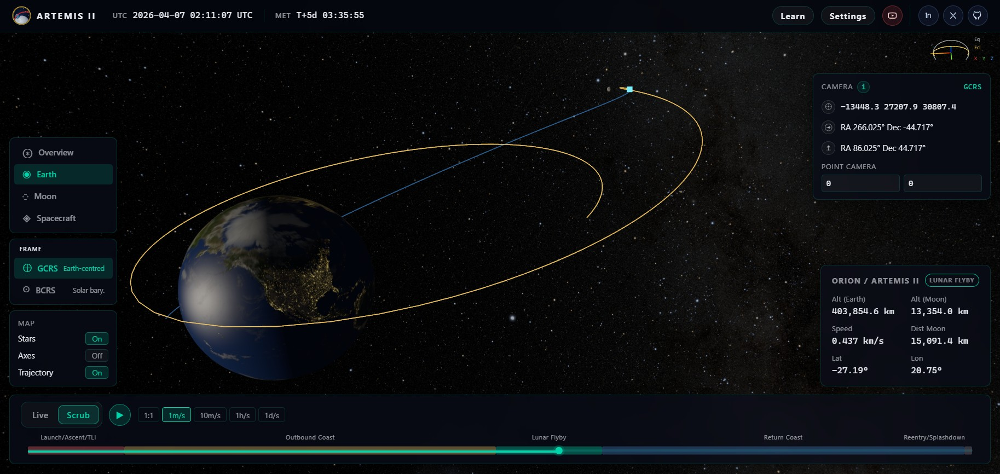
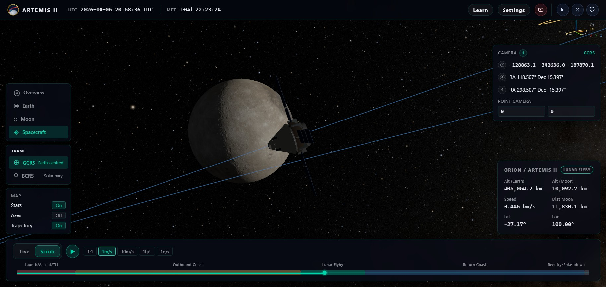
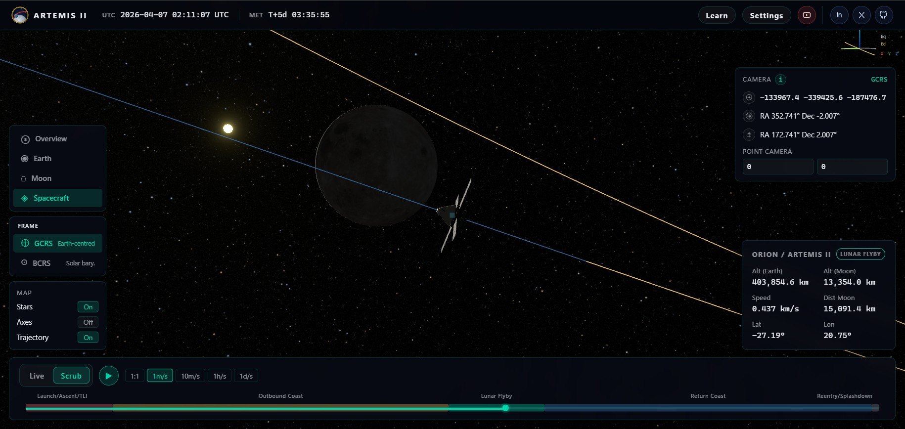
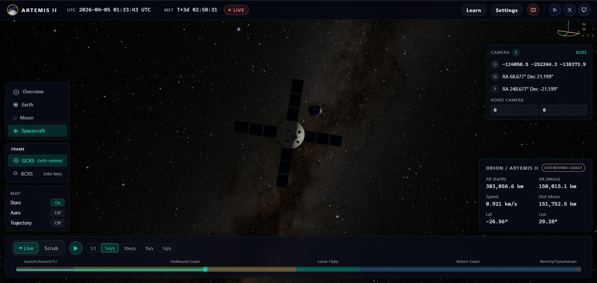

# Artemis II Tracker


Real-time 3D mission tracker for NASA's Artemis II lunar flyby, built with React + Three.js using GCRS/BCRS/ICRS reference frames, ephemeris data from JPL Horizons and SPICE DE440, and a registered celestial sky map.

**Launched:** April 1, 2026 · **Orion capsule:** *Integrity* · **JPL Horizons / NAIF ID:** `-1024`

**[▶ Open live viewer](https://pzarzycki.github.io/artemis-2/)**

| Earth View | Flyby View |
| --- | --- |
|  |  |
|  |  |

<details>
<summary>About this README</summary>

This README defines the scientific frames, time conventions, data products, and texture-registration assumptions used by the viewer.

</details>

## Project Overview

The application renders Earth, Moon, Sun, the Artemis II spacecraft, mission trajectory, a celestial background map, and orientation helpers.

The scientific contract covers:

- frame origin and handedness
- inertial and body-fixed orientation
- time conventions
- ephemeris provenance
- texture registration
- camera reporting in the selected frame

## Deployment

The default public deployment target is GitHub Pages at:

- `https://pzarzycki.github.io/artemis-2/`

For local development, the app runs at:

- `http://localhost:5173/`
- server bind: `0.0.0.0:5173`

## Large Asset Policy

Large star-map EXR files are **not** kept in git.

- local cache directory: [`public/starmaps/`](./public/starmaps/)
- supported resolutions: `4k`, `8k`, `16k`
- default runtime selection: `4k`

For local development, download the required sky maps with:

```bash
uv run python scripts/download_starmaps.py
```

To download only one resolution:

```bash
uv run python scripts/download_starmaps.py 4k
```

The Docker build performs the same download step during image build, so the runtime image remains self-contained even though the EXRs are not tracked in the repository.

## Scale and Design Goals

The scene scale is:

- `1 Three.js unit = 1 km`

The rendering requires:

- one inertial world frame,
- one time convention,
- one body-fixed orientation convention for Earth,
- one body-fixed orientation convention for Moon,
- textures registered to those body-fixed frames,
- every state vector labeled by origin, axes, units, and time scale.

## Rendering Convention

The renderer uses WebGL through Three.js / React Three Fiber.

Project-wide render convention:

- right-handed
- `+X` = red
- `+Y` = green
- `+Z` = blue
- `+Z` is the app-wide up direction

Camera convention:

- an unrotated camera looks along `-Z`
- this project explicitly sets the camera up vector to `(0, 0, 1)`
- local `+X` is camera-right
- local `+Y` is camera-up
- local `-Z` is the viewing axis

Presentation rule:

- the selected scientific Cartesian frame is mapped directly into the render world without handedness flips or hidden axis swaps
- any helper indicator shown in the app must respect that same right-handed `Z-up` convention
- camera position and world-space camera orientation vectors are reported in the selected scene frame
- the camera panel reports orientation primarily as `RA/Dec` angles of the corresponding world-space direction vectors
- those `RA/Dec` values are expressed in decimal degrees in the selected inertial frame

## External References

- IERS Conventions / reference-system material:
  https://iers-conventions.obspm.fr/conventions_material.php
- IERS TN36 Chapter 2, for ICRS / BCRS / GCRS definitions:
  https://iers-conventions.obspm.fr/content/chapter2/tn36_c2.pdf
- NAIF SPICE documentation for `J2000` practical use and its alignment with `ICRF`:
  https://naif.jpl.nasa.gov/pub/naif/toolkit_docs/C/ug/msopck.html
- JPL Horizons manual:
  https://ssd.jpl.nasa.gov/horizons/manual.html
- NAIF generic kernels / DE440:
  https://naif.jpl.nasa.gov/naif/data_generic.html
- NASA SVS CGI Moon Kit:
  https://svs.gsfc.nasa.gov/4720
- NASA Science, Artemis II lunar science operations:
  https://science.nasa.gov/solar-system/nasas-artemis-ii-lunar-science-operations-to-inform-future-missions/
- NASA SVS Deep Star Maps 2020:
  https://svs.gsfc.nasa.gov/4851

## 1. Main World Coordinate System

The default scene is an Earth-centered inertial Cartesian frame aligned with practical `J2000/ICRF` axes:

- origin: Earth center of mass
- `+X`: practical `J2000` x-axis
- `+Y`: practical `J2000` y-axis
- `+Z`: north celestial pole
- handedness: right-handed
- units: kilometers

In the renderer, this scientific frame is mapped directly into the Three.js world without handedness flips or hidden axis swaps. The app UI label `GCRS` should be read in this practical sense: Earth-centered, inertial, and `J2000/ICRF`-aligned for ephemeris work.

Earth stays at `(0, 0, 0)` in this mode. Earth rotation is applied separately through the Earth body-fixed frame:

- `+Z`: terrestrial north pole
- `+X`: equator / Greenwich meridian intersection
- `+Y`: equator / `90°E`

The stored Earth orientation quantity is `gmstRad`, derived from the SPICE `J2000 -> IAU_EARTH` transform and applied as a rotation about inertial `+Z`. At dataset start (`JD 2461131.5`, i.e. `2026-04-01 00:00:00 UTC`), `gmstRad = 3.29775608 rad`, so the Greenwich meridian points at inertial right ascension `188.947505°`.

The app's geographic readouts are spherical rather than geodetic:

- latitude from the equator
- east-positive longitude from `atan2(y, x)` in Earth-fixed coordinates
- altitude above a fixed spherical Earth radius

That is sufficient for visualization, but it is not a WGS84 geodetic model.

## 2. Sun Position

The Sun state used by the default scene is:

- Sun center relative to Earth center
- expressed in the same Earth-centered practical `J2000/ICRF` inertial frame
- units in kilometers

Source:

- SPICE `DE440`
- queried in the pipeline with target `Sun`, observer `Earth center`, frame `"J2000"`

The same Sun vector drives:

- main directional light
- visible Sun marker
- day/night illumination direction on Earth and Moon

### 2.1 Celestial Background

The night-sky background must use a celestial map whose coordinates are aligned with the same inertial axes as the rest of the scene.

Source:

- NASA SVS Deep Star Maps 2020 celestial map

NASA states that this map uses:

- plate carrée projection
- celestial `ICRF/J2000` geocentric right ascension and declination
- map center at `0h` right ascension
- right ascension increasing to the left

App mapping rule:

- world `+X` = `RA 0h`, `Dec 0°`
- world `+Y` = `RA 6h`, `Dec 0°`
- world `+Z` = north celestial pole

Because the NASA map has right ascension increasing to the left, the sky texture must be mirrored horizontally when applied to the inside of the sphere so that increasing right ascension matches the app's right-handed `+X/+Y/+Z` convention.

## 3. Moon Position and Orientation

### 3.1 Moon position

The Moon state used by the default scene is:

- Moon center relative to Earth center
- expressed in the same Earth-centered practical `J2000/ICRF` inertial frame
- units in kilometers

Source:

- local SPICE computation via `spkez(MOON, et, "J2000", "NONE", EARTH)`

Moon position is **not** fetched from Horizons.

External verification:

- the generated Moon state was checked against official JPL Horizons Moon vectors using the same Earth-centered `J2000` / `ICRF`-aligned setup
- agreement was about `0.002 km` at the verified epoch

### 3.2 Moon orientation

Moon rotation is independent of the translational Moon position. The app uses the standard lunar body-fixed frame:

- IAU lunar pole and prime meridian convention via SPICE `IAU_MOON` body-fixed frame
- computed locally via `pxform("J2000", "IAU_MOON", et)`

Moon body-fixed convention used by this project:

- right-handed
- `+Z`: lunar north pole
- `+X`: lunar prime meridian on the equator
- `+Y`: equator / `90°E`

In the renderer, the Moon body frame is separated from the sphere-mesh correction used to map the equirectangular texture onto Three.js `SphereGeometry`. That keeps the displayed local axes tied to the physical lunar frame rather than to the mesh's native `+Y` pole.

### 3.3 Moon texture registration

The Moon texture is part of the Moon-fixed frame definition. It is assumed to be:

- equirectangular longitude-latitude map
- north at top
- south at bottom
- longitude `0°` aligned with the lunar prime meridian

The NASA SVS CGI Moon Kit page states that the published Moon map is centered on `0° longitude`, which is the required cartographic condition for this frame.

## 4. Spacecraft Trajectory and Orientation

The spacecraft trajectory used by the default scene is:

- spacecraft relative to Earth geocenter
- expressed in practical `J2000` / `ICRF`-aligned coordinates
- position in km
- velocity in km/s

Source:

- JPL Horizons REST API (`https://ssd.jpl.nasa.gov/api/horizons.api`)

The documented target is `COMMAND = -1024`, which is the Horizons / NAIF identifier for Artemis II. Horizons also resolves `Artemis II`, and may accept mission aliases such as `Integrity` and `EM-2`.

**Trajectory coverage:** data starts after ICPS separation, about `3h 24m 39s` after launch (`2026-Apr-1 @ 22:35:12 UTC`), i.e. from approximately `2026-Apr-2 @ 01:59:51 UTC`. No trajectory data is available prior to ICPS separation.

The Horizons configuration used for this project is geocentric:

- `COMMAND = -1024`
- `EPHEM_TYPE = VECTORS`
- `CENTER = 500@399`
- `REF_SYSTEM = J2000`
- `REF_PLANE = FRAME`
- `OUT_UNITS = KM-S`

That yields a geocentric inertial spacecraft state in the same `J2000/ICRF`-aligned frame used elsewhere in the app.

Mission-validity condition for this dataset:

- NASA describes Artemis II closest approach as about `4,000 to 6,000 miles` above the Moon’s surface
- that is about `6,437 to 9,656 km` above the lunar surface
- the authoritative trajectory plus corrected SPICE Moon ephemeris yields a closest approach of about `6,583.9 km` above the lunar surface
- a trajectory file that never reaches that band is not acceptable as an Artemis II trajectory for this app

### 4.1 Spacecraft orientation

The app does not use an authoritative spacecraft attitude product. The rendered spacecraft orientation is therefore synthetic:

- point the model approximately along the velocity vector

That is acceptable for visualization, but it must not be described as true Orion attitude.

## 5. BCRS Mode

`BCRS` is the barycentric scene mode:

- origin at the Solar System barycenter
- axes aligned with the `ICRS`

For a true barycentric mode, the project needs:

- `Earth_BCRS(t)` = Earth center relative to Solar System barycenter
- `Moon_BCRS(t)` = Moon center relative to Solar System barycenter
- `Sun_BCRS(t)` = Sun center relative to Solar System barycenter, or a barycentric Sun state directly from the ephemeris
- `SC_BCRS(t)` = spacecraft relative to Solar System barycenter

All of these must be evaluated at the same epoch in the same time convention.

In this implementation, barycentric positions are constructed from the geocentric states using:

- `Moon_BCRS(t) = Earth_BCRS(t) + Moon_geocentric(t)`
- `SC_BCRS(t) = Earth_BCRS(t) + SC_geocentric(t)`

In a true barycentric scene:

- Earth is no longer at the origin
- Moon is no longer geocentric by construction
- spacecraft is no longer geocentric by construction
- the Sun is no longer just a geocentric direction vector

Body rotation models do not change in barycentric mode. Earth texture still means Earth-fixed longitude, and Moon texture still means Moon-fixed longitude.

## Frame Inventory and Handedness

Frames used by the application:

- app render world: right-handed, `+Z` up
- practical geocentric inertial frame (`GCRS` in the UI): right-handed, Earth-centered, `J2000/ICRF`-aligned
- practical barycentric inertial frame (`BCRS` in the UI): right-handed, Solar System barycenter origin, `J2000/ICRF`-aligned
- Earth body-fixed frame: right-handed, rotating with Earth
- Moon body-fixed frame: right-handed, rotating with Moon
- mean ecliptic-of-J2000 helper frame: right-handed, obtained from the equatorial frame by rotation about `+X` by the obliquity

## Time System

The UI uses UTC for mission timestamps and labels.

Horizons vector epochs are reported in `JDTDB`, and this project converts them to a UTC-facing Julian-date grid in `trajectory.json` (`timeScale: UTC`).

Trajectory start `JD 2461132.583227` corresponds to about `2026-04-02T01:59:51 UTC` in the app's UTC-facing timeline.

In the SPICE generation path, each UTC sample instant is converted explicitly to SPICE ephemeris time before evaluating the Earth, Moon, and Sun states. Trajectory samples from Horizons are then mapped to the app's UTC-facing timeline.

Earth orientation is a separate timing problem from inertial state-vector evaluation. In physical terms, Earth longitude belongs to Earth rotation time (`UT1` / sidereal angle), not to the dynamical ephemeris time scale.

## Texture and Cartography Requirements

### Earth

The Earth texture stack is treated as a single registered cartographic product:

- day map
- night map
- clouds
- normal map
- specular map

All of them must share:

- the same projection
- the same zero meridian
- the same north-up orientation

Assumptions:

- equirectangular Earth maps
- prime meridian at the horizontal center of the map
- map center aligned to body `+X`

The renderer applies the body-frame rotation separately from the sphere-mesh correction that maps cartographic north from Three.js local `+Y` to body `+Z`. Source metadata has not yet fully confirmed Greenwich centering for the current Earth texture set.

### Moon

The Moon texture stack is assumed to be:

- equirectangular
- north-up
- `0°` longitude correctly centered
- normal map aligned to the exact same grid as the color map

The Moon texture registration is better documented than the Earth texture registration because the NASA SVS CGI Moon Kit explicitly states the `0°`-centered cartographic condition.

## Body-Fixed Axis Conventions

The application uses the following local-axis conventions:

| Object | Local frame to use | `+X` | `+Y` | `+Z` | Why |
|---|---|---|---|---|---|
| Earth | Earth body-fixed (`IAU_EARTH` / ECEF-like) | Greenwich meridian on equator | `90°E` on equator | terrestrial north pole | Standard terrestrial convention; directly compatible with longitude mapping and Earth rotation |
| Moon | Lunar body-fixed (`IAU_MOON`) | lunar prime meridian on equator | `90°E` lunar longitude | lunar north pole | Standard IAU/NAIF/SPICE cartographic frame |
| Spacecraft | Synthetic flight frame unless true attitude is available | prograde (`v`) | `z × x` | orbit normal (`r × v`) | Gives all three axes a physical meaning without claiming true Orion attitude |

For Earth, local `+Z` stays aligned with inertial world `+Z`, while local `+X/+Y` rotate with Earth rotation. For spacecraft, trajectory alone does **not** define true attitude; the local frame is explicitly synthetic until an authoritative attitude source exists.

## Data Products

### `ephemeris.json`

`ephemeris.json` contains:

- `moonPos...`: Moon relative to Earth center, inertial geocentric frame
- `sunPos...`: Sun relative to Earth center, inertial geocentric frame
- `earthPosBCRS`: Earth relative to Solar System barycenter, barycentric inertial frame
- `gmstRad` or equivalent Earth orientation quantity: Earth rotation for Earth-fixed longitude mapping
- `moonOrientation`: Moon pole and prime meridian orientation

### `trajectory.json`

`trajectory.json` contains:

- spacecraft position relative to Earth center
- spacecraft velocity relative to Earth center
- epoch tags associated with the declared ephemeris time convention
- mission phase metadata for UI annotation

## Known Limits

- The `BCRS` selector is translation-based rather than a full barycentric recomputation of every body state.
- Earth geographic outputs are spherical, not geodetic.
- Earth texture zero-meridian registration is assumed from source textures rather than proven from source metadata.
